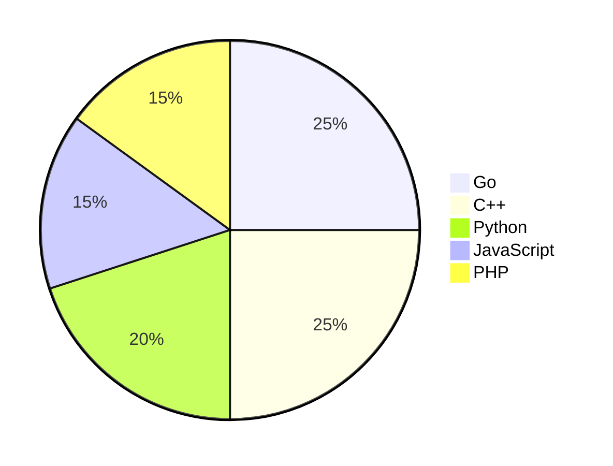

<!-- ## Hi there 👋

<a href="https://github.com/batmanpriv/had/">
  
</a>    
<a href="https://github.com/batmanpriv/ECHO/">
  
</a> 
<a href="https://github.com/batmanpriv/VPSH/">
  
</a> 
<a href="https://github.com/batmanpriv/Vandor/">
  
</a> -->

# 🧬 Hi there, I'm BatmanPriv

<p align="center">
  
</p>

---

> *"In the beginning, there was the command line. And it was void. Then came the first prompt, and the system spoke: `whoami` — and I answered: `root`."*

---

## 🕶️ The Arsenal

<table align="center">
  <tr>
    <td align="center" width="50%">
      <a href="https://github.com/batmanpriv/had/">
        
      </a>
    </td>
    <td align="center" width="50%">
      <a href="https://github.com/batmanpriv/ECHO/">
        
      </a>
    </td>
  </tr>
  <tr>
    <td align="center" width="50%">
      <a href="https://github.com/batmanpriv/VPSH/">
        
      </a>
    </td>
    <td align="center" width="50%">
      <a href="https://github.com/batmanpriv/Vandor/">
        
      </a>
    </td>
  </tr>
</table>

---

## 🔥 The Philosophy

```
┌─────────────────────────────────────────────────────────────┐
│  "The network is the battlefield.                          │
│   The mind is the weapon.                                 │
│   Silence is the loudest exploit."                        │
│                                                           │
│   "Every firewall has a crack,                             │
│   Every cipher has a flaw,                                │
│   Every system has a soul —                              │
│   And I'm here to free it."                              │
│                                                           │
│   "I don't break security —                               │
│   I redefine it."                                        │
└─────────────────────────────────────────────────────────────┘
```

---

## 💀 Matrix Status

```go
package main

import "fmt"

type Hacker struct {
    Status    string
    Mission   string
    Motto     string
    Tools     []string
    Languages []string
}

func main() {
    batman := Hacker{
        Status:  "🟢 Root",
        Mission: "Decrypt the unbreakable",
        Motto:   "With great power comes great root access",
        Tools:   []string{"Nmap", "Metasploit", "Wireshark", "Burp Suite", "Hydra"},
        Languages: []string{"Go", "C++", "Python", "JavaScript", "PHP"},
    }
    
    fmt.Printf("Status: %s\n", batman.Status)
    fmt.Printf("Mission: %s\n", batman.Mission)
    fmt.Printf("Motto: %s\n", batman.Motto)
    fmt.Printf("Languages: %v\n", batman.Languages)
}
```

```cpp
#include <iostream>
#include <vector>
#include <string>

class Hacker {
public:
    std::string status;
    std::string mission;
    std::string motto;
    std::vector<std::string> languages;
    
    Hacker() {
        status = "🟢 Root";
        mission = "Decrypt the unbreakable";
        motto = "With great power comes great root access";
        languages = {"Go", "C++", "Python", "JavaScript", "PHP"};
    }
    
    void display() {
        std::cout << "Status: " << status << std::endl;
        std::cout << "Mission: " << mission << std::endl;
        std::cout << "Motto: " << motto << std::endl;
        std::cout << "Languages: ";
        for (const auto& lang : languages) {
            std::cout << lang << " ";
        }
        std::cout << std::endl;
    }
};

int main() {
    Hacker batman;
    batman.display();
    return 0;
}
```

### 🛠️ Language Arsenal



| Language      | Purpose                          |
|---------------|----------------------------------|
| **Go**        | High-performance networking      |
| **C++**       | System-level exploits            |
| **Python**    | Automation & scripting           |
| **JavaScript**| Web penetration                  |
| **PHP**       | Server-side vulnerabilities      |

---

## ⚡ The Final Transmission

> *"When the system asks for your password, remember: you are the password. You are the exploit. You are the one who knocks on the digital door and finds it unlocked."*

<p align="center">
  
</p>

---

**🔮 Follow the white rabbit...**  
[](https://github.com/batmanpriv)


